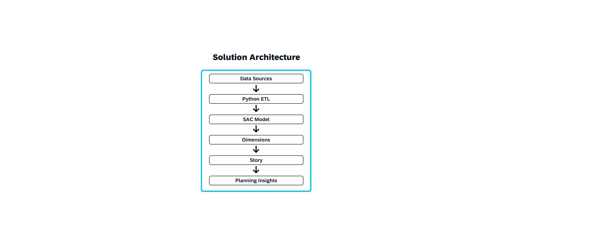
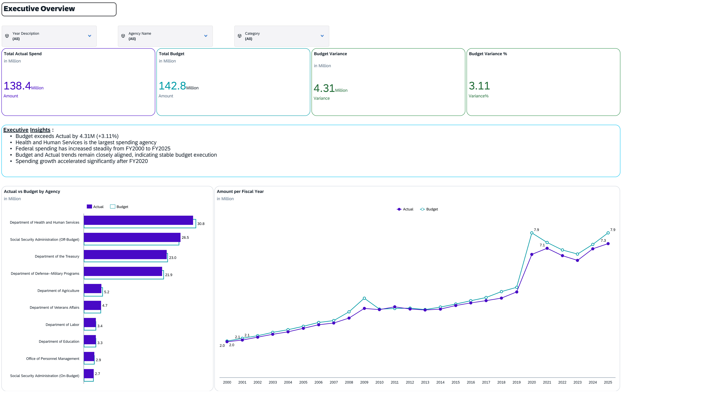
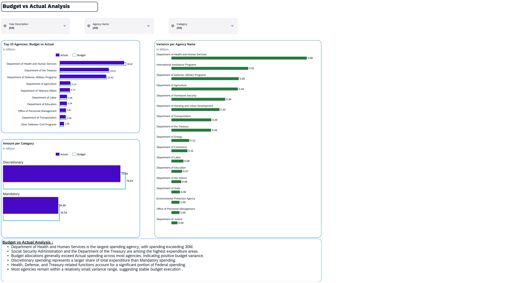
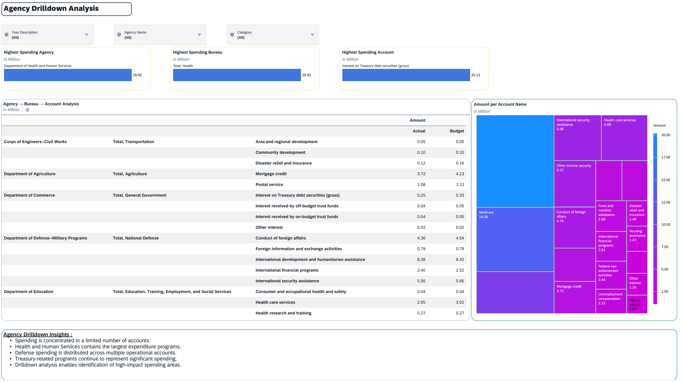

# SAP Analytics Cloud FP&A Dashboard

## Budget vs Actual, Drilldown & Forecast Planning

### Project Overview

This project demonstrates an end-to-end Financial Planning & Analysis (FP&A) solution developed using SAP Analytics Cloud (SAC).

The solution analyzes US Federal Budget data and provides:

* Executive financial reporting
* Budget vs Actual analysis
* Agency-level variance analysis
* Agency → Bureau → Account drilldowns
* Forecast and scenario planning
* Interactive filtering and KPI monitoring

---

## Dashboard Export

[Download Dashboard PDF](Dashboard%20Export/SAP_Analytics_Cloud_FPA_Solution.pdf)

---

## Business Objective

Develop an executive dashboard that enables stakeholders to:

* Monitor budget performance
* Compare Actual vs Budget spending
* Analyze spending by Agency, Bureau, and Account
* Identify spending drivers
* Evaluate future spending scenarios

---

## Project Highlights

- Built end-to-end FP&A dashboard using SAP Analytics Cloud
- Analyzed 60+ years of US Federal Budget data
- Developed Budget vs Actual reporting framework
- Implemented Agency → Bureau → Account drilldowns
- Created forecast and scenario planning models
- Designed executive KPI dashboards and variance analysis

---

## Dataset Information

**Source:** US Office of Management and Budget (OMB)

**Data Coverage:** FY1962–FY2025

**Dashboard Analysis Period:** FY2000–FY2025

### Dimensions

* Agency Name
* Bureau Name
* Account Name
* Fiscal Year
* Version
* Category

### Measure

* Amount

---

## Solution Architecture

OMB Historical Budget Tables

            ↓

Data Cleaning & Transformation (Python)

            ↓

SAP Analytics Cloud Data Model

            ↓

Dimensions & Measures

            ↓

Story Dashboard

            ↓

Forecast & Scenario Planning



---

## Dashboard Pages

### 1. Executive Overview

Features:

* KPI Summary
* Budget vs Actual Trends
* Executive Insights
* Interactive Filters



### 2. Budget vs Actual Analysis

Features:

* Agency-Level Analysis
* Category-Level Analysis
* Variance Analysis
* Spending Comparison



### 3. Agency Drilldown Analysis

Features:

* Agency → Bureau → Account Hierarchy
* Detailed Spending Analysis
* Treemap Visualization
* Largest Agency/Bureau/Account KPIs



### 4. Forecast & Scenario Planning

Features:

* Conservative Scenario (+2%)
* Base Scenario (+5%)
* Aggressive Scenario (+8%)
* Forecast Comparison Analysis
* Planning Insights


---

## Technologies Used

* SAP Analytics Cloud (SAC)
* Python
* Jupyter Notebook
* Data Modeling
* Financial Planning & Analysis (FP&A)
* Data Visualization
* Scenario Planning

---

## Skills Demonstrated

* SAP Analytics Cloud Story Design
* Data Modeling
* Budget vs Actual Reporting
* Forecasting
* Scenario Planning
* Financial Analytics
* KPI Development
* Dashboard Design
* Data Transformation

---

## Repository Structure

```text
Data/
Code/
Screenshots/
Architecture/
Dashboard Export/
README.md
```

---

## Author

Sujay G R

SAP Analytics Cloud Enthusiast

